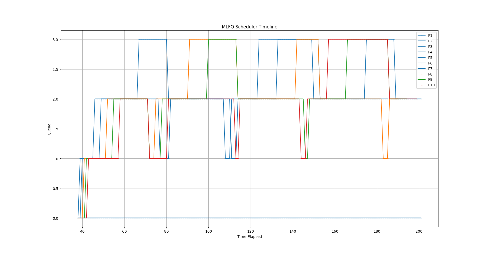
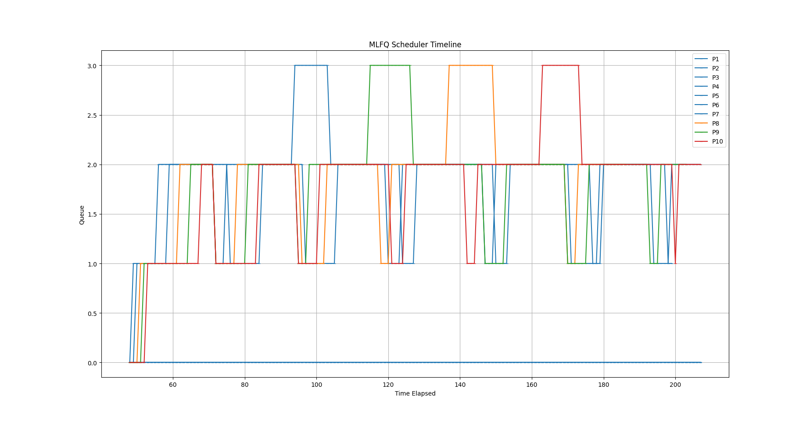
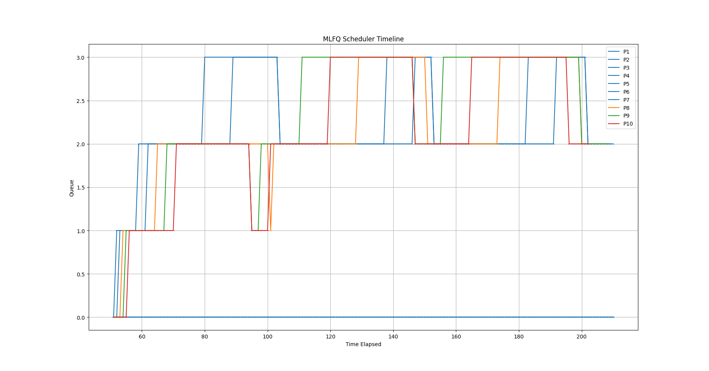

# PART-A:-
# Implementing Different policies for Scheduling :

## First come first serve (FCFS)
**Description** : Implements the process which comes first till it get completed.

**Implementation** : <br>
In scheduler function i will check for the process which comes first among all the process <br>
i.e i will search for the process which has minimum **ctime**


Here is the code for FCFS

```c
    struct proc* select = 0;

    for (p = proc; p < &proc[NPROC]; p++)
    {
      acquire(&p->lock);  
      if (p->state == RUNNABLE && (!select ||  p->ctime < select->ctime))
      {
        if(!select ||  p->ctime < select->ctime)
        {
          if(select)
          {
            release(&select->lock);
          }
          select = p;
        }
        else
        {
          release(&p->lock);
        }
      }
      else
      {
        release(&p->lock);
      }
    }

    if(select !=0 )
    {
      select->state = RUNNING;
      c->proc = select;
      swtch(&c->context, &select->context);
      c->proc = 0;
      release(&select->lock);
    }
```


And also we did not iterrupt process till it complete so **yield()** is commented while FCFS policy is using.

<br>

## Multi level feedback queue (MLFQ)

**Description** :  
Different priority queues are maintained.Process in high priority queues run first if that process takes more time than corresponding time limit of that queue then that process is pushed into next low priority queue.

After some time(waittime) of that process is last executed it pushed into next high prority queue to prevent starvation.(called Aging).

**Implementation** :<br>
I defined some new variables in __struct proc__ such as<br>
1.qentry<br>
2.qwaittime<br>
3.qlevel<br>
4.qpresent<br>

Other than these I formed array of 'four' queues corresponding to each priority and declared some functions to push
,pop and initialize the queues. They are:-<br>
1.void Enqueue(struct Queue* que,struct proc* p)<br>
2.struct Queue* Dequeue(struct Queue* que)<br>
3.void Enqueue_front(struct Queue* que,struct proc* p)<br>

In **allocproc()** function intialize qlevel=0,qwaittime=0,qentry=0 and qpresent=0.<br>
In **scheduler()** function <br>
1.Iterate over all process and add them into respectives which are RUNNABLE and not present in the queue.<br>
2.Now iterate over every process and check whether the waittime of that process is greather than Threshold if it is greather then move it to above high priority queue.<br>
3.Find the process which is first in the non-empty queue and that is the next we are going to run.<br>
In **usertrap()** function when __which_dev==2__ we have to check for the process runtime(i.e qentry) is greather ticks corresponding to that queue.

# Analysis
## For RoundRobin (RR)
Average runtime : 15<br>
Average waittime : 162

## For First come First serve (FCFS)
Average runtime : 15<br>
Average waittime : 131

## For Multi level Feedback Queueu (MLFQ)
Average runtime : 16   <br>
Average waittime : 162

# MLFQ scheduling analysis
1. **when Aging time = 30**


2. **When Aging time = 20**


3. **When Aging time = 40**


# Disclaimer
Implementing MLFQ without aging time worked well but with aging time it is not done properly<br>
Tried to debug but couldn't done.


#
#
#

<!-- Extra space before heading -->
# PART-B:-
# Difference between Traditional TCP and Our TCP
1.Time required to transfer data is more in case of TCP implemented using UDP because it is always available to listen and to stop it we have to loop for some more time than required.<br>
2.No control flow is managed in TCP implemented by UDP.<br>
3.In traditional TCP while ending communication it will be done Three steps or four steps but here no such procedure is followed.<br>
4.In TCP while starting the communication it follows four step mechanism while here it is not the case.

# Extension for Implementation of flow Control
1.Putting some rate limit to receive the data.<br>
Eg:- using 'recvfrom()' function with regular intervals.<br>

2.If sender sending too fast then receiver will send an alert or information packet with recommnened rate limit.<br>

I will declare a count=0 variable initially in server and if there are rejectects more than capability.<br>
Eg:-
```c
int count = 0;
while(completed(check,num_chunks))
    {
        for(int i=0;i<num_chunks;i++)
        {
            if(check[i]==0)
            {
                int recvstatus = recvfrom(serversocket,chunks[i],sizeof(struct information),0,(struct sockaddr*)&clientaddr,&lenclient);
                if(recvstatus<0)
                {
                  printf("not Received");
                }
                else
                {
                    printf("Received chunk with seq number: %d\n",chunks[i]->number);
                    ackchunks[i]->acknumber = chunks[i]->number;
                    gettimeofday(&current,NULL);
                    ackchunks[i]->time = current.tv_sec*1000 + current.tv_usec/1000;
                    sendto(serversocket,ackchunks[i],sizeof(struct retransmission),0,(struct sockaddr*)&clientaddr,sizeof(clientaddr));
                    if(ackchunks[i]->time - chunks[i]->time < 100)
                    {
                        check[i] = 1;
                    }
                    count++;
                }
            }
        }
    }
```
<br>
If count value is greater than threshold value in some particular period of time then i will send an alert to client to send data with regular gap of time.